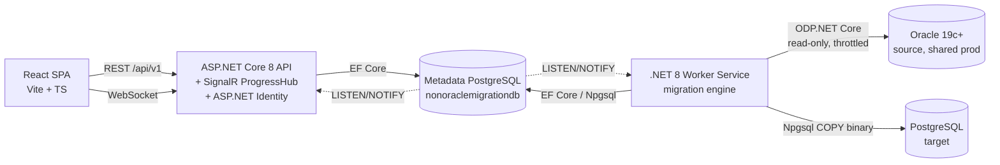
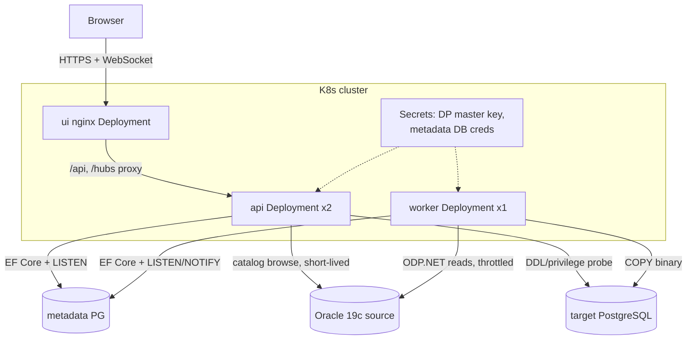
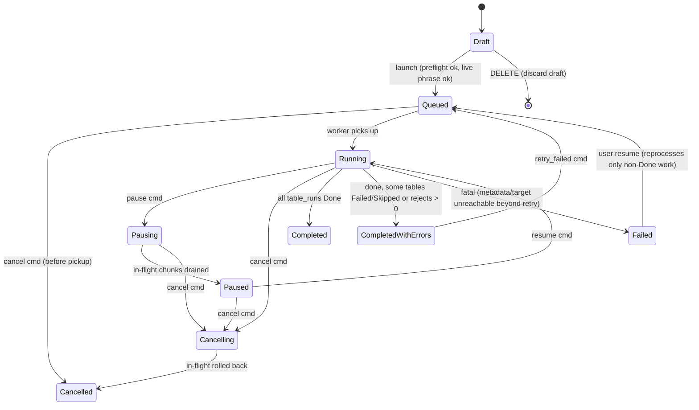
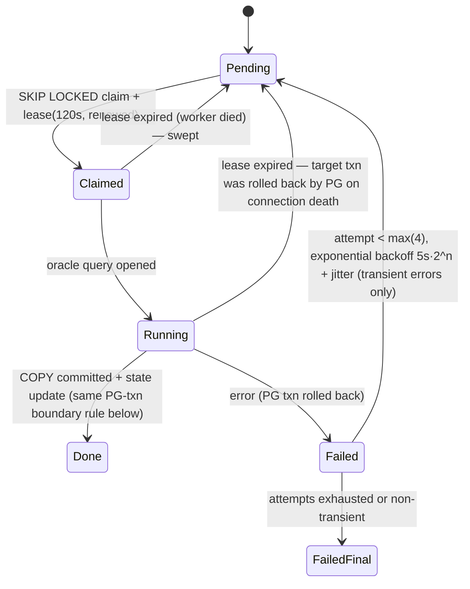

# Technical Plan — Oracle → PostgreSQL Bulk Data Migration Platform ("O2P")

**Status:** Draft for review. No application code will be written until you reply `APPROVED — START DEVELOPMENT`.

## Context

You need a production-grade tool to move table data (schema + rows) from shared/production Oracle 19c+ databases into PostgreSQL: single tables up to 300 GB, whole databases up to 4 TB, hundreds of tables per run, with controllable read impact on the Oracle side. The deliverable of this phase is this plan; the intended outcome of the project is a self-hosted web application (React UI + .NET 8 API + .NET 8 Worker) that an operator can use to define connections, build table manifests, launch parallel migrations, watch live progress, resume after failure without duplicates, and validate results.

**Decisions locked with you (2026-07-04):**

| Decision | Choice | Rationale |
|---|---|---|
| UI stack | React 18 + Vite + TypeScript | Best dashboard/charting ecosystem for chunk maps and throughput charts; SPA survives backend restarts; SignalR JS client for live updates |
| Worker scaling (v1) | Single worker node, **multiple concurrent jobs** | One node hits the throughput target; the operator may run one job or several jobs of an application concurrently on that node. All jobs share one global Oracle-session budget + memory budget (§1.5, §3.2). Multi-*node* stays v2 (`FOR UPDATE SKIP LOCKED` already in place) |
| Oracle floor | 19c+, read-only, **explicit itemized grants** | No object creation or package execution on source; app computes ROWID ranges itself from `DBA_EXTENTS`. Itemized per-view + per-table `READ` grant checklist in §4.6 for the DBA team (not the broad `SELECT_CATALOG_ROLE`) |
| App auth | Local accounts (ASP.NET Identity) | Roles: Admin / Operator / Viewer; audit trail records the identity |
| Target PG hosting | Self-hosted on a VM (physical server) | Full server tuning available — UNLOGGED loads, `wal_level`, `max_wal_size` are all usable (unlike managed PG). PG 14+ assumed for numeric ±Infinity |
| Identifier policy | **preserve-quoted** (default) | Target names exactly match Oracle (`"ORDER_HEADER"`); every emitted DDL/DML quotes identifiers. Lowercase-snake remains a per-application/per-run option |
| Target schema | **operator-chosen per run** | The New Run wizard prompts for the target schema (default = lowercased Oracle owner); one fixed schema or per-owner mapping also selectable |
| Timezone policy | **BDT, UTC+6 (`Asia/Dhaka`)** | Oracle read sessions run `ALTER SESSION SET TIME_ZONE='Asia/Dhaka'`; TSLTZ values render in BDT and store as the correct `timestamptz` instant |
| Retention | 30 days (all categories) | Metrics, run logs, reject payloads, and run history all purged after 30 days |

**Confirmed out of scope for v1** (listed as v2 candidates in §11): CDC/ongoing sync, PL/SQL conversion, views/triggers/procedures/grants, FK dependency ordering and FK recreation, standalone sequences, function-based/bitmap/domain indexes (reported and skipped), check constraints, SDO_GEOMETRY/object types (reported and skipped per-column).

**Deviations from the proposed stack (with justification):**
- The API and Worker communicate through the metadata PostgreSQL database (command table + `LISTEN/NOTIFY`) instead of a message broker — no extra infrastructure, durable by construction, sufficient at this scale (§1.3).
- `synchronous_commit=off` is offered as spec'd, but **chunk COPY transactions always commit with `SET LOCAL synchronous_commit = on`**: with async commit, a target crash can erase an acknowledged commit after metadata already recorded the chunk Done — silent data loss that resume would never repair. The fsync cost is one per ~768 MB chunk, i.e. nothing (§3.6, §8.3).

**Repo hygiene note:** `applictiondbcredential.txt` (metadata DB credentials) is sitting untracked in the repo root. Confirmed as this app's metadata store (`application.naasbd.com:7936/nonoraclemigrationdb`); it is now added to `.gitignore` and its secrets move to environment variables / user-secrets at M0.

---

## 1. Architecture

### 1.1 Components



- **Web UI** — React SPA served as static files (nginx container). Talks REST for CRUD/commands and SignalR for live progress.
- **API service** — ASP.NET Core 8. Owns: auth (Identity + JWT), all CRUD, Oracle catalog browsing (short-lived read connections), job creation/commands, SignalR fan-out, report/log downloads. Never touches the bulk data path.
- **Migration Worker** — separate .NET 8 Worker Service process. Owns the entire hot path: chunk planning, Oracle reads, type conversion, PG COPY writes, chunk state transitions, metrics sampling. Separate process so API deploys/restarts never kill a 300 GB load, and the worker gets dedicated CPU/memory.
- **Metadata DB** — the provided PostgreSQL instance. EF Core allowed here only. Also stores the ASP.NET Data Protection key ring so API and Worker share credential decryption.

### 1.2 Clean Architecture layout (single solution)

```
src/
  O2P.Domain           — entities, state machines, type-mapping model, chunk plan model (no deps)
  O2P.Application      — use cases, orchestration ports (IChunkPlanner, ITableLoader, ...), DTOs, validators
  O2P.Infrastructure.Oracle    — ODP.NET dictionary queries, chunk planners, streaming readers
  O2P.Infrastructure.Postgres  — Npgsql COPY writers, DDL executor, validation queries, target catalog probe
  O2P.Infrastructure.Metadata  — EF Core DbContext, repositories, LISTEN/NOTIFY, Data Protection store
  O2P.Api              — controllers, SignalR hub, Identity, Serilog request logging
  O2P.Worker           — job runner, table scheduler, pipeline host, lease sweeper, metrics sampler
web/                   — React app
```

### 1.3 API ↔ Worker coordination (no message broker)

- **Commands** (start/pause/resume/cancel): API inserts a row into `job_commands`, then `NOTIFY o2p_commands`. Worker holds a dedicated Npgsql connection with `LISTEN o2p_commands` plus a 5 s poll fallback. Durable (survives both processes restarting), ordered, auditable.
- **Progress**: Worker updates `chunks`/`table_runs` transactionally as part of chunk completion (that's the resume source of truth), and every ~2 s flushes an in-memory aggregate to `metrics_samples` + `NOTIFY o2p_progress`. API listens and pushes to SignalR groups (`job:{id}`). UI update latency target ≤ 2 s.
- Justification vs a broker: one job's telemetry is a few rows/second; the metadata DB is already a hard dependency; RabbitMQ/Redis would add an infra component with no throughput benefit.

### 1.4 Deployment

**Docker Compose (dev / single VM):** `ui` (nginx, also reverse-proxies /api and /hubs), `api`, `worker`, optional `metadata-pg` (or point at the provided instance). Worker container gets a resource reservation (recommended: 8–16 vCPU, 8 GB RAM — memory math in §3.4).

**Kubernetes:** Deployment `api` (2 replicas, stateless), Deployment `worker` (replicas: 1 in v1 — enforced), UI via nginx Deployment or any static host, Secrets for connection bootstrap + Data Protection master key, `readiness = metadata DB reachable`. Worker uses a PreStop hook: stop claiming chunks, drain in-flight chunks (bounded by `terminationGracePeriodSeconds ≈ 120 s`), release leases. Anything not drained is recovered by the lease sweeper (§8.3).



Per-run log download across separate containers: both processes ship run-scoped Serilog events to `run_logs` in the metadata DB (bounded level, retention-purged); the API serves `GET /jobs/{id}/logs` from there — no shared volume needed. Local rolling files remain for node-level diagnostics.

### 1.5 Scaling model

- **v1 (scale-up, multi-job):** one worker process runs a `JobRunner` per active job. The operator can launch a single job or several jobs of an application concurrently. Parallelism inside each job = N concurrent tables × M chunk workers per large table; **across all concurrent jobs a single global governor enforces the node-wide caps** — total Oracle sessions ≤ `global_max_oracle_sessions`, total chunk workers ≤ the memory budget (§3.4). A fair-share scheduler hands session/worker slots to jobs round-robin (optional per-job priority weight) so one big job cannot starve others. Per-application and per-job sizing knobs set each job's *maximum* draw; the governor caps the *sum*.
- **Concurrency guardrails:** two jobs may not write the same target table (enforced by the `target_name_allocations` unique registry — §6.3); the New Run wizard warns if a new job's source Oracle slot already has heavy in-flight read load so the operator can stagger.
- **v2 (scale-out, designed-for now):** chunk claiming is `SELECT ... FOR UPDATE SKIP LOCKED` with `worker_id` + `lease_expires_at` already in the schema; adding worker replicas requires only enabling multi-claim and per-worker session budgets. No schema or algorithm change.

### 1.6 Security

- Credentials: AES-256-GCM via ASP.NET Data Protection (`IDataProtector`), key ring persisted in the metadata DB and protected with a master key from environment/K8s Secret. Plaintext passwords never leave the API/Worker processes, never logged, masked in all DTOs (`"password": "•••"`), and the UI only ever writes them (write-only field).
- TLS to Oracle (TCPS optional) and PG (`sslmode` configurable per connection profile).
- AuthZ: Admin (users, connections, applications), Operator (manifests, runs), Viewer (read-only dashboards). Runs targeting a **PG-Live** slot additionally require the typed confirmation phrase (`MIGRATE <application-name> LIVE`), checked server-side.
- Audit: `run_events` rows for every state-changing action (user, application, env pair, timestamp, detail).

---

## 2. Metadata DB schema

PostgreSQL, schema `o2p`, managed by EF Core migrations. PKs are `bigint identity` unless noted. All timestamps `timestamptz`.

| Table | Purpose / key columns |
|---|---|
| `users`, `roles`, ... | Standard ASP.NET Identity tables (Admin/Operator/Viewer) |
| `dataprotection_keys` | Data Protection key ring (`xml`) |
| `connections` | `name` (unique), `kind` ('oracle'\|'postgres'), `host`, `port`, `service_or_db`, `username`, `secret_ciphertext bytea`, `options jsonb` (ssl, pool size, default fetch size, oracle: sid-vs-service), `created_by`, timestamps |
| `applications` | `name` (unique), `description`, `defaults jsonb` — max_concurrent_tables, max_chunk_workers_per_table, global_max_oracle_sessions, chunk_target_mb, batch_target_mb, fetch_size_mb, identifier_policy, collision_policy, error_policy(+abort threshold), throttle (mb_s, rows_s), offpeak_window, lob thresholds, post-load flags (pk, indexes, analyze, validate depth) |
| `application_connections` | `application_id`, `slot` ('oracle_test'\|'oracle_live'\|'pg_test'\|'pg_live'), `connection_id`; **unique(application_id, slot)** |
| `type_mapping_rules` | Layered overrides: `scope` ('global_default'\|'application'\|'table'\|'column'), `application_id?`, `manifest_table_id?`, `column_name?`, `match jsonb` (source type pattern, precision/scale predicates), `target_type`, `options jsonb` (e.g. lob policy, nan policy). Resolution order: column > table > application > global default |
| `manifests` | `application_id`, `name`, `version int`, `notes`, `created_by`; **unique(application_id, name, version)**; new versions are new rows (immutable once used by a job) |
| `manifest_tables` | `manifest_id`, `owner`, `table_name`, `included bool`, `where_clause text?`, `excluded_columns text[]`, snapshot stats: `est_rows`, `est_bytes`, `has_lobs bool`, `is_partitioned bool`, `is_iot bool` |
| `discovery_cache` | Per (connection, owner): table list with `num_rows`, `segment_bytes`, `lob_bytes`, `refreshed_at` — backs the manifest builder grid without hammering Oracle |
| `jobs` | `application_id`, `manifest_id`, `source_slot`, `target_slot`, `mode` ('migrate'\|'dry_run'\|'validate_only'), `options jsonb` (frozen copy of effective settings), `status`, `live_confirmation_ok bool`, `created_by`, `queued_at`, `started_at`, `finished_at`, `totals jsonb` (bytes est/moved, tables done) |
| `job_commands` | `job_id`, `scope` ('job'\|'table_run'\|'chunk'), `table_run_id?`, `chunk_id?`, `command` ('pause'\|'resume'\|'cancel'\|'retry_failed'\|'update_throttle'\|'update_parallelism'), `payload jsonb?` (e.g. new MB/s cap), `issued_by`, `issued_at`, `processed_at?` — live-tuning commands are applied to the worker's token bucket/scheduler and the effective value recorded in `run_events` (frozen `jobs.options` stays the launch-time record) |
| `table_runs` | `job_id`, `manifest_table_id`, `source_owner`, `source_table`, `target_schema`, `target_table` (resolved, incl. `_mgN`), `status` (§8.2), `collision_action_taken`, `chunk_strategy` ('rowid'\|'pk_range'\|'partition_rowid'\|'single'), `total_chunks`, `rows_copied`, `bytes_copied`, `ddl_text`, `mapping_report jsonb`, `validation jsonb`, `error_count`, `paused_at?`, `paused_by?` (per-table pause must survive worker restarts — §8.2), `started_at`, `finished_at`; index (job_id, status) |
| `chunks` | `table_run_id`, `seq`, `strategy`, `lo text`, `hi text` (ROWIDs, PK bounds, or partition name), `state` (§8.3), `attempt int`, `max_attempts`, `worker_id?`, `lease_expires_at?`, `rows_copied`, `bytes_copied`, `last_error text?`, `started_at`, `finished_at`; **index (table_run_id, state)**; claimed via `FOR UPDATE SKIP LOCKED` |
| `target_name_allocations` | `pg_connection_id`, `schema_name`, `base_name`, `suffix_n int` (0 = base name), `table_run_id`, `status` ('reserved'\|'created'\|'abandoned'); **unique(pg_connection_id, schema_name, base_name, suffix_n)** — the atomicity backstop for `_mgN` (§6.3) |
| `row_rejects` | `table_run_id`, `chunk_id`, `source_rowid text?`, `reason`, `column_name?`, `payload jsonb` (canonicalized row image), `created_at` — a dedicated rejects table in the metadata DB (targets stay clean); per-table abort threshold enforced against `count(*)`. **When a table produces any rejects, the run raises an alert (SignalR + `run_events`) naming the exact location** (`o2p.row_rejects WHERE table_run_id = …`) and offers a per-table JSON export, so no reject is silent |
| `validation_results` | `table_run_id`, `check_kind` ('rowcount'\|'null_count'\|'min_max'\|'sum'\|'sample_hash'), `column_name?`, `source_value text`, `target_value text`, `passed bool`, `detail jsonb` |
| `metrics_samples` | `job_id`, `table_run_id?`, `ts`, `rows_per_s`, `mb_per_s`, `active_chunk_workers`, `oracle_sessions` — 2 s cadence during runs, downsampled to 1 min after 24 h, **purged after 30 days** (retention policy, `settings`) |
| `run_events` | Audit: `job_id?`, `actor`, `event`, `detail jsonb`, `at` |
| `run_logs` | Run-scoped structured log events: `job_id`, `ts`, `level`, `source`, `message`, `props jsonb` — written by a Serilog sink from both API and Worker; backs the per-run log download across separate containers (§1.4); retention-purged |
| `settings` | Singleton app settings: retention days (metrics, run_logs, rejects, history — **all default 30**) and ops toggles — backs the Admin settings screen and `GET/PUT /settings/retention`; a daily purge job enforces them |

Design points:
- **Chunk row = unit of resume.** Everything needed to re-execute a chunk (strategy + bounds + source/target identity via its table_run) lives in the row; no in-memory state survives a crash and none needs to.
- Job `options` are frozen at job creation (copy of application defaults + per-run overrides) so later settings edits never change a running/rerun job.
- `metrics_samples` is insert-only and batched; progress UI truth for "done" comes from `chunks`, not samples.
- **`_o2p_chunk_log` lives in the TARGET database, not here:** a tiny transient table created alongside each loading table with `PRIMARY KEY (table_run_id, chunk_seq)` — the duplicate-fence and durability-reconciliation anchor (§8.3); dropped after table completion.

---

## 3. Data-path pipeline design

### 3.1 Unit of work: the chunk

The pipeline unit is a **chunk** (§4): one bounded Oracle query + one PG transaction containing one `COPY ... FROM STDIN (FORMAT BINARY)`. This gives:
- **Idempotent resume for free** — COPY is transactional; a failed/interrupted chunk rolls back completely, so re-running a Pending/Failed chunk can never duplicate rows.
- **Short-lived Oracle cursors** — each chunk is a fresh query, bounding ORA-01555 (snapshot too old) exposure and UNDO pressure on the shared source.

### 3.2 Threading model

```
Worker process
├── GlobalGovernor — node-wide semaphores shared by ALL concurrent jobs:
│     • Oracle-session slots per source connection profile (global_max_oracle_sessions)
│     • chunk-worker slots (memory-budget cap, §3.4)
│     • fair-share arbiter: round-robins slots across active jobs (per-job priority weight)
└── JobRunner (1 per running job — several run concurrently)
    ├── TableScheduler — picks next table_runs to activate (largest-first, LOB-lane aware),
    │                    max N active tables (default 4), skips table-scope-paused tables
    └── per active table_run: TableRunActor
        ├── plans chunks once (or loads existing on resume)
        └── spawns M ChunkWorkers (default: up to 8 for large tables, 1 for <256 MB)
              ChunkWorker loop:
                0. acquire an Oracle-session slot + chunk-worker slot from GlobalGovernor
                1. claim next Pending chunk (FOR UPDATE SKIP LOCKED, set lease)
                2. open Oracle cmd for chunk range; FetchSize = fetch_size_mb
                3. producer Task: read rows → convert via precompiled column
                   converter delegates → append to pooled RowBatch (~8 MB or 10k rows)
                   → write to Channel<RowBatch>(capacity 3, bounded, wait-on-full)
                4. consumer Task: BeginBinaryImport → stream batches → Complete()
                   → commit PG txn (SET LOCAL synchronous_commit=on) + mark chunk Done (§8.3)
                5. release batch buffers to pool; release governor slots; next chunk
```

- Global constraint holds **across all concurrent jobs**: total active ChunkWorkers ≤ `global_max_oracle_sessions` per source profile (default 16) and ≤ the memory-budget worker cap. Each job's own N × M sets its ceiling; the GlobalGovernor caps the sum so N concurrent jobs cannot collectively exceed the node/source limits.
- Conversion happens on the producer side using a per-table array of `Func<OracleDataReader, int, PgValue>` delegates compiled once from the mapping plan — no per-row type dispatch or reflection in the loop.
- Backpressure: bounded channel blocks the producer when PG is slower; the Oracle cursor simply isn't advanced (forward-only, no materialization). Throttling (§3.5) also gates the producer.
- `Pause` = stop claiming new chunks (in-flight chunks drain). `Cancel` = cancel tokens, roll back in-flight chunk txns, mark job Cancelled. Both at job and table scope.

### 3.3 LOB lane

- Discovery marks tables LOB-heavy when LOB segment bytes > 20% of table bytes or avg LOB > 4 KB (from `DBA_LOBS` + segment stats).
- LOB-heavy tables run in a **dedicated lane**: `max_lob_tables` (default 1–2) counted separately from N so narrow tables are never starved behind slow LOB streams; per-table M is reduced (default 2–4) because LOB reads are round-trip-bound, not bandwidth-bound.
- Read tuning: `InitialLOBFetchSize` = 1 MB (LOBs ≤ 1 MB arrive inline with the row — one round trip); larger LOBs are read via `GetOracleBlob()/GetOracleClob()` in 1 MB segments. Write side: if the pinned Npgsql version supports `Stream`/segmented value writes in `NpgsqlBinaryImporter`, LOBs stream end-to-end; otherwise the value is assembled in a pooled buffer, worst case bounded by the 512 MB reject threshold below (M3 includes a spike to pin this down). `LONG`/`LONG RAW` columns (fetched whole via `InitialLONGFetchSize = -1`) force the table into the LOB lane with a single reader and the same size cap.
- **Hard limit policy:** PostgreSQL `bytea`/`text` values are capped at 1 GB. **Confirmed: no source LOB exceeds ~100 MB**, comfortably under the 1 GB `bytea` limit — so no `pg_largeobject` lane is needed in v1, and the default reject threshold sits at 512 MB purely as a defensive backstop (configurable: fail-table). A 100 MB max also means the streaming buffer worst case is ~100 MB per active LOB worker, folded into the §3.4 budget.
- CLOB canonicalization: NUL policy applied streamingly (§5.3).

### 3.4 Memory budget — 300 GB table

Per ChunkWorker steady state (defaults):

| Component | Size |
|---|---|
| ODP.NET fetch buffer (`FetchSize`, bytes-based) | 16 MB |
| RowBatch channel: 3 × 8 MB (bounded) | 24 MB |
| Batch being built (producer) + batch being written (consumer) | 2 × 8 MB = 16 MB |
| LOB streaming segment + COPY output buffer | ~5 MB |
| **Per worker total (with 1.5× fragmentation/overhead factor)** | **≈ 90 MB** |

Global (the GlobalGovernor caps this sum **across all concurrent jobs**, not per job): concurrent chunk workers = min(Σ N×M, global_max_oracle_sessions) = 16 (default) → **≈ 1.5 GB** + process baseline (~300 MB) + metrics/EF (~200 MB). **LOB worst case:** if Npgsql can't stream a `bytea` value, a LOB worker buffers up to the ~100 MB max LOB; with a LOB lane of 2–4 workers that adds ≈ 200–400 MB. Total envelope ≈ 2 GB → fits a 4 GB container; **8 GB recommended** for headroom with concurrent jobs + LOB spikes.

Key property: memory is a function of **worker count × buffer sizes only — never table size**. A 300 GB table flows through the same envelope; the table is consumed as ~450 chunks of ~768 MB (§4.2), each streamed row-by-row. The governor computes this budget at startup from actual settings and admits new jobs only while the projected sum fits the container limit (read from cgroup) — a job that would breach it queues instead of thrashing memory.

### 3.5 Source protection (throttling)

- `global_max_oracle_sessions` per connection profile — hard cap, semaphore-enforced; preflight also checks `v$resource_limit` headroom when granted.
- Token-bucket rate limiter on bytes read (MB/s) and/or rows/s, checked per batch in the producer; configured per application, adjustable live per job (UI slider → job_commands).
- Off-peak window: cron-style window in job options; outside the window the scheduler stops claiming chunks (in-flight drain), auto-resumes when the window opens. All reads use plain serial `SELECT` — **no PARALLEL hints on source by default** (opt-in per application).

### 3.6 PG write tuning (per-session / per-run options, all defaulted safe)

| Option | Default | Notes |
|---|---|---|
| `synchronous_commit` | **chunk COPY txns always commit with `SET LOCAL synchronous_commit = on`** | With async commit, PG can acknowledge a COMMIT that a subsequent crash erases — metadata would then say Done for rows that no longer exist (silent loss, and nothing would re-run the chunk). One fsync per ~768 MB chunk is negligible, so `off` buys nothing on the COPY path. `off` remains a per-session option for the salvage INSERT path and post-load steps; §8.3's marker reconciliation is the backstop either way |
| COPY format | binary | Text COPY fallback per table when binary can't represent a value class (§5.4) |
| `maintenance_work_mem` (session, index build phase) | 1 GB (configurable) | Plus `max_parallel_maintenance_workers` guidance |
| `max_wal_size` guidance | 16–64 GB during bulk loads | Documented in ops guide + preflight warning if tiny; also `checkpoint_timeout 15–30min` |
| UNLOGGED load → `SET LOGGED` | off by default | Trade-offs documented: no WAL during load (fast), but table is truncated on crash recovery, invisible to replicas, and `SET LOGGED` rewrites the whole table through WAL at the end. Worth it only when target has no replicas and the final rewrite is acceptable; exposed as per-job option with warning text. When enabled, `_o2p_chunk_log` is created UNLOGGED too, so a crash truncates data and markers together and §8.3's resume reconciliation forces a clean reload instead of a silently-empty "Done" table |
| `wal_level = minimal` note | ops guide only | COPY into a table created in the same transaction skips WAL entirely, but requires server restart, no replication, and one-transaction-per-table (conflicts with chunk resume) — documented as an expert manual mode for greenfield targets, not an app feature in v1 |

### 3.7 Throughput target

**Target: ≥ 150 MB/s sustained aggregate per worker node (acceptance floor 100 MB/s)**, assumptions:
- Worker node: 16 vCPU, 8 GB RAM, 10 GbE to both databases (≤ 1 ms RTT to PG, ≤ 5 ms to Oracle).
- Oracle source can serve ≥ 250 MB/s serial multi-session reads without breaching throttles; no severe row chaining.
- Target PG on NVMe, `synchronous_commit=off`, no indexes during load.
- Mix without dominant LOB lane (LOB-heavy tables realistically achieve 20–60 MB/s due to round trips).
- Basis: single-session serial Oracle read of a narrow table typically yields 20–40 MB/s; COPY binary single session 80–150 MB/s; 12–16 concurrent chunk workers saturate ~150–300 MB/s aggregate before NIC limits. 300 GB table at 150 MB/s ≈ **34 min**; at the 100 MB/s floor ≈ 51 min.

---

## 4. Chunking algorithm

### 4.1 Strategy selection (per table, recorded on table_run)

```
if IOT (DBA_TABLES.IOT_TYPE IS NOT NULL)
                          → pk_range: IOTs have no physical ROWIDs and their rows live in
                            the SYS_IOT_TOP index segment, so extent math cannot apply —
                            this test MUST precede the partitioned test (a partitioned IOT
                            routed to partition_rowid would plan zero chunks = silent loss);
                            per-partition pk_range when partitioned
else if partitioned       → partition_rowid: per-(sub)partition, extent-split within each
else if heap table        → rowid: extent-based ROWID ranges (primary)
else (tiny/exotic: <256 MB, clusters, no usable PK)
                          → single: one chunk, serial read
```

Backstop: the ROWID planner **fails the table loudly** — never "0 chunks = done" — if a table with `est_rows > 0` yields zero extents (catches IOT overflow segments, clusters, or any segment-lookup mismatch).

### 4.2 ROWID-range planning (primary; read-only, works on any 19c)

This reproduces what `DBMS_PARALLEL_EXECUTE.CREATE_CHUNKS_BY_ROWID` does, without needing execute privileges or creating any objects on the source:

```sql
SELECT e.file_id, e.block_id, e.blocks, e.bytes, o.data_object_id, e.relative_fno
FROM   dba_extents e
JOIN   dba_objects o
       ON  o.owner       = e.owner
       AND o.object_name = e.segment_name
       AND ( (o.subobject_name IS NULL AND e.partition_name IS NULL)
          OR  o.subobject_name = e.partition_name )
WHERE  e.owner        = :owner
AND    e.segment_name = :table_name
AND    e.segment_type LIKE 'TABLE%'
AND    o.object_type  LIKE 'TABLE%'
ORDER  BY o.data_object_id, e.relative_fno, e.block_id
```

Planner then, per `data_object_id`, greedily accumulates extents in **(relative_fno, block_id) order — the exact key a ROWID encodes. Never absolute `file_id`: it can disagree with relative-file order (transported tablespaces, high file numbers), which would emit ranges with `lo > hi` (silently missed rows) or overlapping ranges (duplicates).** A chunk also never spans a datafile boundary (new chunk whenever `relative_fno` changes — at most one extra chunk per file), making every range trivially well-ordered. Chunks target `chunk_target_mb` (default 768 MB → ~450 chunks for 300 GB) with bounds:

```
start_rowid = DBMS_ROWID.ROWID_CREATE(1, data_object_id, first.relative_fno, first.block_id, 0)
end_rowid   = DBMS_ROWID.ROWID_CREATE(1, data_object_id, last.relative_fno,
                                      last.block_id + last.blocks - 1, 32767)
```

(computed **client-side only** — the 18-char base-64 ROWID encoding is public and stable; no `DBMS_ROWID` calls on the source, preserving the zero-package-execution posture even on hardened databases that revoke PUBLIC execute. The planner asserts `end_rowid > start_rowid` in binary ROWID order for every emitted chunk.)

Chunk read query:

```sql
SELECT /*+ NO_PARALLEL(t) NO_INDEX(t) */ <mapped columns>
FROM   <owner>.<table> t
WHERE  t.rowid BETWEEN :lo AND :hi
  AND  (<user WHERE filter, if any>)
```

Correctness notes:
- ROWIDs encode `data_object_id`, so a range can safely span extent gaps within one segment/file: blocks belonging to other segments have different object ids and never match.
- Ranges never span two `data_object_id`s (each partition has its own) — chunks are always intra-segment.
- Coverage is complete: every row lives in some extent of its segment; the union of chunk ranges covers all extents. Rows moved by ongoing DML can be missed/seen twice **only if the source table is being modified during migration** — the tool is a bulk migrator, not CDC; consistency expectations are documented (§10 R6) and the row-count validation catches drift.
- Chained rows are returned by their head-piece ROWID only — no duplication across chunks.

### 4.3 Partition-wise (partitioned tables)

Enumerate `DBA_TAB_PARTITIONS`/`DBA_TAB_SUBPARTITIONS`; each (sub)partition's extents are chunked exactly as §4.2 (its own `data_object_id`). Read queries stay plain ROWID-range queries (no `PARTITION(...)` clause needed — ROWID ranges are intrinsically partition-local). Benefit: planning parallelism and per-partition progress fall out naturally.

### 4.4 PK-range fallback (IOTs, or ROWID strategy disabled)

For a numeric/date single-column PK: **exact edges first** — `SELECT MIN(<pk>), MAX(<pk>) FROM <owner>.<table>` (index MIN/MAX scan, near-free) — then interior boundaries from a sampled pass:

```sql
SELECT MAX(pk_val) hi                                  -- upper bound of each bucket
FROM (SELECT <pk> pk_val, NTILE(:n_chunks) OVER (ORDER BY <pk>) bucket
      FROM <owner>.<table> SAMPLE BLOCK (1) )          -- ~1% of blocks (SAMPLE(1) alone is
GROUP BY bucket ORDER BY hi                            --  ROW sampling = full scan); full
                                                       --  scan acceptable only < 10 GB
```

Chunk queries: first chunk `pk >= :true_min AND pk < :b1`, interior `pk >= :b_i AND pk < :b_i+1`, last `pk >= :b_last AND pk <= :true_max`. The exact MIN/MAX edges guarantee no rows fall below the first or above the last chunk — sampled boundaries only shape the interior split, where an error costs balance, not correctness. Composite/non-numeric PKs in v1: fall back to `single` with a warning (v2: multi-column keyset chunking).

### 4.5 Skew handling

If a chunk exceeds 4× `chunk_target_mb` actual bytes read (LOB-heavy rows), the worker finishes it but the planner's next tables adapt batch/LOB thresholds; no mid-chunk splitting in v1 (chunks are already ≤ ~1 GB by extent math; only LOBs can inflate them, and the LOB lane absorbs that).

### 4.6 DBA grant checklist (hand to DBA team; migration user e.g. `O2P_READER`)

```sql
-- Identity & basic access
CREATE USER o2p_reader IDENTIFIED BY ... ;
GRANT CREATE SESSION TO o2p_reader;
-- Dictionary access — EXPLICIT ITEMIZED GRANTS (your choice; NOT SELECT_CATALOG_ROLE,
-- which is broader than needed). Each names exactly the view the app queries:
GRANT SELECT ON SYS.DBA_TABLES         TO o2p_reader;
GRANT SELECT ON SYS.DBA_TAB_COLUMNS    TO o2p_reader;
GRANT SELECT ON SYS.DBA_TAB_COLS       TO o2p_reader;
GRANT SELECT ON SYS.DBA_TAB_COMMENTS   TO o2p_reader;
GRANT SELECT ON SYS.DBA_COL_COMMENTS   TO o2p_reader;
GRANT SELECT ON SYS.DBA_SEGMENTS       TO o2p_reader;
GRANT SELECT ON SYS.DBA_EXTENTS        TO o2p_reader;
GRANT SELECT ON SYS.DBA_OBJECTS        TO o2p_reader;
GRANT SELECT ON SYS.DBA_TAB_PARTITIONS TO o2p_reader;
GRANT SELECT ON SYS.DBA_TAB_SUBPARTITIONS TO o2p_reader;
GRANT SELECT ON SYS.DBA_PART_TABLES    TO o2p_reader;
GRANT SELECT ON SYS.DBA_LOBS           TO o2p_reader;
GRANT SELECT ON SYS.DBA_INDEXES        TO o2p_reader;
GRANT SELECT ON SYS.DBA_IND_COLUMNS    TO o2p_reader;
GRANT SELECT ON SYS.DBA_CONSTRAINTS    TO o2p_reader;
GRANT SELECT ON SYS.DBA_CONS_COLUMNS   TO o2p_reader;
GRANT SELECT ON SYS.V_$RESOURCE_LIMIT  TO o2p_reader;  -- REAL name; "V$..." → ORA-02030
GRANT SELECT ON SYS.V_$SESSION         TO o2p_reader;  -- (V$ names are public synonyms)
-- Data access — itemized per-object READ (preferred; READ cannot do SELECT...FOR UPDATE,
-- so the account can never take row locks on production). The app GENERATES this exact
-- list from the manifest for the DBA to run:
GRANT READ ON <schema>.<table> TO o2p_reader;         -- one per manifest table
-- (fallback only if per-object grants are impractical: GRANT READ ANY TABLE TO o2p_reader;)
-- (SELECT ANY TABLE only as legacy fallback — it additionally permits FOR UPDATE locks)
-- Session hygiene (no writes, no DDL, no packages needed — chunking is client-side)
```

The app's preflight verifies each of these and reports exactly which grant is missing; the PG-side counterpart checklist is §6.4.

---

## 5. Type-mapping engine

### 5.1 Default mapping table

| Oracle | PG default | .NET carrier on hot path | Notes |
|---|---|---|---|
| `NUMBER(p,0)` p≤4 | `smallint` | `short` | via `GetInt16` |
| `NUMBER(p,0)` p≤9 | `integer` | `int` | |
| `NUMBER(p,0)` p≤18 | `bigint` | `long` | |
| `NUMBER(p,0)` p>18 | `numeric(p)` | `OracleDecimal` → §5.4 | beyond `decimal` range |
| `NUMBER(p,s)` s>0 | `numeric(p,s)` | `decimal` if p≤28 else §5.4 | |
| `NUMBER` (no p) | `numeric` | §5.4 path | up to 38+ digits |
| `NUMBER(p,s)` s<0 or s>p | `numeric` (no typmod) | §5.4 path | PG negative-scale typmod needs 15+; bare `numeric` is always safe |
| `BINARY_FLOAT` | `real` | `float` | NaN/±Inf pass through |
| `BINARY_DOUBLE` | `double precision` | `double` | NaN/±Inf pass through |
| `FLOAT(b)` | `double precision` | `double` | b>53 loses precision — flagged in mapping report; override to `numeric` available |
| `VARCHAR2(n BYTE)` | `varchar(n)` | `string` | n bytes ≥ n chars, so `varchar(n)` (chars) can never overflow |
| `VARCHAR2(n CHAR)` / `NVARCHAR2(n)` | `varchar(n)` | `string` | `ALL_TAB_COLS.CHAR_USED`/`CHAR_LENGTH` decide n |
| `CHAR(n)` / `NCHAR(n)` | `char(n)` | `string` | blank-pad semantics preserved |
| `DATE` | `timestamp(0)` | `DateTime` | Oracle DATE has time — never pg `date` |
| `TIMESTAMP(f)` | `timestamp(min(f,6))` | `DateTime` | f 7–9: fractional seconds truncated app-side during conversion (deterministic, not PG rounding); noted in mapping report |
| `TIMESTAMP(f) WITH TIME ZONE` | `timestamptz` | `DateTimeOffset` | absolute instant preserved exactly (independent of session TZ); PG stores the instant, original offset not retained (PG semantics) — noted |
| `TIMESTAMP(f) WITH LOCAL TIME ZONE` | `timestamptz` | `DateTime` (session TZ) | **Session TZ policy: every Oracle read session runs `ALTER SESSION SET TIME_ZONE = 'Asia/Dhaka'` (BDT, UTC+6)** so TSLTZ values are normalized against BDT and stored as the correct `timestamptz` instant. PG `timezone` GUC recommended `Asia/Dhaka` for display consistency. (Plain `TIMESTAMP`/`DATE` have no zone and are copied as wall-clock values, unaffected by this setting.) |
| `CLOB` / `NCLOB` | `text` | streamed `TextReader` | NUL policy §5.3 |
| `BLOB` | `bytea` | streamed 1 MB segments | >512 MB → reject policy (§3.3) |
| `RAW(n)` / `LONG RAW` | `bytea` | `byte[]` | LONG RAW via `InitialLONGFetchSize = -1` |
| `LONG` | `text` | `string` | same |
| `ROWID` / `UROWID` | `varchar(18)` / `varchar(4000)` | `string` | default include; per-column skip option |
| `XMLTYPE` | `xml` | `string` | read via `XMLSERIALIZE(DOCUMENT col AS CLOB)` |
| `INTERVAL YEAR TO MONTH` | `interval` | months `int` | encoded in PG's binary interval wire format (months, days, µs) — a binary COPY stream cannot mix text-format values |
| `INTERVAL DAY TO SECOND` | `interval` | days `int` + µs `long` | same binary encoding; sub-µs fraction (Oracle allows 9 digits) truncated + reported |
| JSON (`VARCHAR2/CLOB/BLOB IS JSON`, 19c) | `text` default; `jsonb` opt-in | `string` | jsonb opt-in because it re-validates/normalizes |
| Identity column (12c+) | same base type + `GENERATED BY DEFAULT AS IDENTITY` | | post-load `setval(pg_get_serial_sequence(...), max+1)` |
| Virtual column | **excluded** (default) | | listed in mapping report; v2: generated columns |
| Invisible column | included (configurable) | | |
| `SDO_GEOMETRY`, object/collection types, `ANYDATA`, `BFILE` | **skip column + warn** (default) or fail | | always in dry-run report; PostGIS is v2 |

Resolution: column override > table override > application override > this default table (all stored in `type_mapping_rules`).

### 5.2 Length semantics

`VARCHAR2(30 BYTE)` can hold at most 30 characters (every char ≥ 1 byte), so mapping byte-length n to `varchar(n)` (character semantics) is always sufficient — no widening needed. `NVARCHAR2(n)` length is in UTF-16 code units; character count ≤ code units, so `varchar(n)` is likewise safe. Optional app-level policy `all_strings_to_text` for teams that prefer no length constraints.

### 5.3 Edge-case policies (all per-application defaults, per-column overridable)

| Case | Options | Default |
|---|---|---|
| NUL `0x00` in VARCHAR2/CLOB (PG rejects) | `strip` \| `replace(U+FFFD)` \| `reject_row` \| `fail_table` | **strip**, with per-column counter surfaced in mapping/validation report |
| Oracle `''` ≡ NULL | (informational — Oracle already stores NULL; reader sees NULL) | write **NULL**; report flags string columns so app teams know `WHERE col = ''` semantics change on PG |
| NaN / ±Inf in BINARY_DOUBLE/FLOAT | to `double precision`: pass through (PG supports) | pass through |
| NaN / ±Inf when column overridden to `numeric` | PG 14+ supports `Infinity`/`NaN` in numeric; older: `null` \| `reject_row` \| `fail` | pass on PG ≥ 14, else **reject_row** |
| Invalid/undecodable byte sequences (source charset lies) | ODP.NET substitutes U+FFFD during NLS conversion | **All sources confirmed AL32UTF8**, so lossless — but preflight still verifies `NLS_CHARACTERSET = AL32UTF8` per source and warns if any database isn't, and the converter counts any U+FFFD substitutions as a data-quality signal in the report |
| Charset | Target `client_encoding` pinned to UTF8; AL32UTF8 → UTF8 is a lossless code-point copy | — |
| Numeric value exceeds declared p/s after mapping override | `reject_row` \| `fail_table` | reject_row |
| Zero/invalid dates (e.g. year 0, 4713 BC edges from corrupt data) | PG timestamp range is wider than Oracle's — passes; truly invalid values (ORA read errors) | reject_row |

### 5.4 High-precision NUMBER path (COPY binary correctness)

.NET `decimal` holds only 28–29 significant digits; Oracle NUMBER holds 38–40. For columns with p>28 (or unknown p), the reader fetches `OracleDecimal` and the writer encodes PG `numeric` binary format directly from the `OracleDecimal` digit string (sign, weight, base-10000 digit groups — a small, well-specified encoder in the PG writer). If any column in a table hits a value the binary encoder can't represent, the table's loader falls back to **text COPY** for that table (logged, counted). This keeps binary COPY as the primary path (per spec) without silently corrupting big numerics.

### 5.5 Identifier policy

- **Default `preserve_quoted`** (per your decision): emit `"ORDER_HEADER"` exactly as Oracle spells it, quoted in every generated DDL and DML statement (COPY target, index DDL, validation queries) so casing round-trips exactly. Consequence documented for the ops team: hand-written queries against the target must also quote these names (`SELECT * FROM "ORDER_HEADER"`). Alternative per-application/per-run policy `lowercase`: `ORDER_HEADER` → `order_header` (unquoted, PG-idiomatic).
- Under `preserve_quoted`, quoting sidesteps reserved-word collisions automatically; under `lowercase`, PG reserved words are still force-quoted.
- 63-byte limit **with suffix headroom** (applies under either policy — the limit is on bytes, independent of casing): table base names longer than 57 bytes are truncated to 49 bytes + `_` + 7-char lowercase hex of xxHash32 of the full original name (= 57 bytes), reserving 6 bytes for a `_mgNN` suffix. Any suffixed candidate must itself re-pass the 63-byte check (§6.3 step 4) — PG silently truncates identifiers at 63 bytes, which would desync the catalog from `target_name_allocations` and collide `base` with `base_mg1`. Column names use the full budget (55 + `_` + 7-hex). Dedupe is guaranteed by the hash + the allocation registry.
- Mapping report always lists original → final identifiers.

---

## 6. DDL generation & `_mgN` collision handling

### 6.1 DDL rules

- `CREATE SCHEMA IF NOT EXISTS <target_schema>` — **the target schema is chosen by the operator per run** in the New Run wizard (§7.2 screen 6). Options: (a) mirror source — one target schema per Oracle owner, named as the owner under the active identifier policy; (b) a single fixed schema for the whole run; (c) an explicit per-owner mapping. Default preselection = mirror-source. The resolved schema is frozen into `table_runs.target_schema`.
- `CREATE TABLE` with mapped column types only — **all columns nullable; no PK, no indexes, no FKs, no defaults, no triggers** at create time (exactly FR-4.4). `NOT NULL` is applied as a post-load `ALTER TABLE ... SET NOT NULL` step, and **only for Oracle constraints with `DBA_CONSTRAINTS`/`DBA_TAB_COLUMNS` status VALIDATED** — `ENABLE NOVALIDATE` NOT NULLs can hide real NULLs in existing rows and would otherwise abort COPY chunks mid-load or spuriously reject legitimate source rows; NOVALIDATE cases are reported and skipped.
- Column order preserved from Oracle (`COLUMN_ID`).
- `COMMENT ON TABLE/COLUMN` carried over (configurable, default on).
- Post-load (per-table config): `SET NOT NULL` (validated constraints only, per above), PK as `ALTER TABLE ... ADD PRIMARY KEY`, then plain/unique b-tree indexes translated from `DBA_INDEXES`/`DBA_IND_COLUMNS` (function-based/bitmap/domain/reverse → skipped + reported), then `ANALYZE <table>`, then validation (§6.5). Index DDL runs with session `maintenance_work_mem` per §3.6.
- Full DDL text stored on `table_runs.ddl_text` and included in dry-run bundle.

### 6.2 Collision policies (per application, per-run overridable)

`suffix` (default, the `_mgN` rule) | `truncate_and_load` (requires Live confirmation when target is Live) | `fail` | `skip`.

### 6.3 Atomic `_mgN` allocation (race-free under N-table parallelism)

Serialization point is the **metadata DB**, not the target:

```
1. BEGIN metadata txn
2. SELECT pg_advisory_xact_lock( hash(pg_connection_id, schema, base_name) )   -- serializes this name family
3. candidates = allocations for (conn, schema, base) UNION live target catalog scan
   (information_schema.tables WHERE table_schema = :s
    AND table_name ~ ('^' || regex_escape(base) || '(_mg[0-9]+)?$'))
   -- regex, not LIKE: underscores in base would act as wildcards and pull in
   -- unrelated tables; N is parsed from the trailing digits capture only
4. next = base if free else base_mgN, N = max(parsed N)+1;
   re-check UTF-8 byte length: candidate > 63 bytes → re-derive via §5.5
   hash-truncation of the SUFFIXED name (PG would otherwise silently truncate
   the identifier and collide with the base allocation)
5. INSERT target_name_allocations(status='reserved', ...)    -- unique index is the backstop
6. COMMIT (releases advisory lock)
7. Execute CREATE TABLE on target.
   - success → allocation.status='created'
   - duplicate_table (external actor won a race) → status='abandoned', goto 1 (max 5 attempts)
```

Because step 3 checks the **live target catalog too**, tables created outside the app are respected; because the registry is unique-constrained, even a bug in the lock path cannot double-allocate a suffix. On job **resume**, the table_run's already-resolved `target_table` is reused — resume never allocates a new `_mgN`.

### 6.4 Target PG privilege checks (FR-1 Test Connection + FR-10 preflight)

Mirror of the Oracle checklist in §4.6, probed per PG connection profile and re-verified at preflight, each item reported pass/fail:

| Check | Probe |
|---|---|
| Connect + version + latency | `SELECT version()` round-trip |
| `CREATE` on database (for `CREATE SCHEMA`) | `has_database_privilege(current_user, current_database(), 'CREATE')` |
| `CREATE`/`USAGE` on target schema (if pre-existing) | `has_schema_privilege(...)` |
| DDL + write round-trip | create/drop `_o2p_probe` table in target schema; INSERT + one-row COPY |
| Version floor | PG ≥ 14 (numeric ±Infinity, performance) — warn below floor |
| Free disk vs estimate | operator-entered quota compared to estimated target size (managed PG rarely exposes FS free space via SQL); `pg_ls_waldir()`-based probing only when the role has `pg_monitor` |

### 6.5 Validation design (FR-8)

- **Row count — mandatory and always on**, never gated by the 'validate depth' setting. Source: `SELECT COUNT(*) FROM <owner>.<table> WHERE <manifest WHERE>` — the same filter the chunk queries applied; target: `SELECT count(*)`. A mismatch flags the table CompletedWithErrors, showing the delta against the `row_rejects` count (rejects are the only legitimate explanation for a difference).
- **Optional deep checks** (per-table 'validate depth'), each side generated as ONE aggregate query honoring the WHERE filter and column exclusions:
  - per-column null counts (`COUNT(*) - COUNT(col)`);
  - `MIN`/`MAX` on comparable columns, rendered through the canonicalizer below;
  - `SUM` over exact-numeric columns compared exactly (`numeric` semantics both sides); float sums compared with relative tolerance 1e-9 and labeled approximate;
  - **sampled row-hash**: the app draws K PKs (default 10 000) from the **target** after load (`TABLESAMPLE SYSTEM`, sample persisted in `validation_results.detail` for reproducibility), fetches exactly those rows from both sides in PK batches, and renders every value through a single canonicalizer in the worker — invariant-culture normalized numeric text (trailing zeros trimmed), ISO-8601 UTC timestamps with 6 fraction digits, bytea → SHA-256, NULL → sentinel — then concatenates with 0x1F separators and compares per-row SHA-256. App-side hashing sidesteps cross-engine hash/format differences entirely; the first N mismatching PKs are reported.
- Results land in `validation_results`, exportable via `GET /jobs/{id}/validation?format=csv|json`. Documented caveat: counts drift if the source is written during/after the load (risk R6) — final cutover runs should be quiesced.

---

## 7. API endpoints & UI screens

### 7.1 REST API (`/api/v1`, JWT bearer)

Role matrix — **Viewer**: GET on jobs, table-runs, metrics, validation, run history only (no users, connections, or audit). **Operator**: Viewer + manifests, type rules, discovery refresh, job create/launch/commands. **Admin**: everything, incl. users, connections, applications, settings, audit.

| Area | Endpoints |
|---|---|
| Auth | `POST /auth/login`, `POST /auth/refresh`, `GET /auth/me` |
| Users (Admin) | `GET/POST /users`, `PUT /users/{id}`, `PUT /users/{id}/role`, `DELETE /users/{id}` |
| Connections | `GET/POST /connections`, `GET/PUT/DELETE /connections/{id}`, `POST /connections/{id}/test` → `{latencyMs, serverVersion, privileges:[{name, ok, detail}]}` |
| Applications | `GET/POST /applications`, `GET/PUT/DELETE /applications/{id}`, `PUT /applications/{id}/slots`, `PUT /applications/{id}/defaults` |
| Discovery | `GET /applications/{id}/tables?slot=oracle_test&refresh=false` (cached grid data: owner, table, rows, MB, LOB%, partitioned), `POST .../tables/refresh` |
| Manifests | `GET/POST /applications/{id}/manifests`, `GET /manifests/{id}`, `POST /manifests/{id}/versions`, `PUT /manifests/{id}/tables` (bulk incl. regex/paste/CSV results), `GET/POST /manifests/{id}/export|import` (JSON, includes mapping overrides), `POST /applications/{id}/validate-where` (server-side Oracle parse probe of a per-table WHERE clause — backs the manifest builder's validate button) |
| Type rules | `GET/PUT /applications/{id}/type-rules`, `GET/PUT /manifest-tables/{id}/type-rules` |
| Jobs | `POST /jobs` (creates a **Draft**; body: application, manifest@version, source_slot, target_slot, mode, option overrides), `POST /jobs/{id}/launch` (the §8.1 Draft→Queued guard: server re-runs preflight and validates `liveConfirmationPhrase` here), `DELETE /jobs/{id}` (Draft only), `GET /jobs?application=&status=`, `GET /jobs/{id}` (full detail incl. table summaries), `POST /jobs/{id}/commands` `{command: pause|resume|cancel|retry_failed|update_throttle|update_parallelism, scope: job|table_run|chunk, tableRunId?, chunkId?, payload?}` — live throttle changes travel in `payload`; single-chunk retry uses scope `chunk` |
| Preflight/dry-run | `POST /jobs/{id}/preflight` → checklist result; dry-run jobs produce `GET /jobs/{id}/artifacts` (DDL bundle zip, mapping report, size estimate) |
| Table runs | `GET /jobs/{id}/table-runs`, `GET /table-runs/{id}` (chunk map data), `GET /table-runs/{id}/chunks?state=failed`, `GET /table-runs/{id}/rejects` |
| Validation/reports | `GET /jobs/{id}/validation?format=json|csv`, `GET /jobs/{id}/logs` (per-run structured logs served from `run_logs` in the metadata DB — works across separate API/Worker containers, §1.4), `GET /jobs/{id}/metrics?from=&to=&resolution=` |
| Audit | `GET /audit?job=&actor=&from=` |
| Settings (Admin) | `GET/PUT /settings/retention` (metrics, run_logs, rejects, history) |
| Health | `GET /healthz`, `GET /readyz` |
| SignalR | `/hubs/progress` — client joins `job:{id}`; server events: `jobStats` (tablesDone/total, gbMoved/gbTotal, aggregateMBs, etaSeconds), `tableStats` (rows%, bytes%, rowsPerSec, chunkStates[], errorCount), `jobStateChanged`, `tableStateChanged` |

### 7.2 UI screens (React, 10 screens)

1. **Login** — local account form.
2. **Home / Dashboard** — active jobs with live aggregate MB/s + ETA cards; recent runs; quick links.
3. **Connections** — grid (name, kind, host, masked user); editor drawer with Test Connection panel showing latency, server version, per-privilege ✓/✗ list.
4. **Application detail** — 4 slot cards (Oracle-Test/Live, PG-Test/Live) with bound connection + test status; defaults form (parallelism, chunk MB, throttles, naming/collision/error policies, type-rule editor table).
5. **Manifest builder** — source table grid (search, owner filter, regex include/exclude box, paste-list dialog, CSV upload) with row counts/sizes/LOB badges; per-table drawer (WHERE filter with validate button, column exclude checklist); saves as new manifest version; version history panel.
6. **New Run wizard** — 5 steps: (1) env pair picker (source slot → target slot matrix); (2) manifest@version; (3) **target schema resolution** — mirror-source (default) / single fixed schema / explicit per-owner map (§6.1), with identifier-policy toggle (preserve-quoted default); (4) options (mode incl. dry-run, collision/error policy, throttle, off-peak window, post-load toggles, per-job priority weight for the fair-share governor); (5) preflight checklist → if target slot is PG-Live, typed confirmation phrase → Launch. Because several jobs of an application may run at once, this step also shows the current node-wide session/worker headroom and warns if the source slot is already under heavy in-flight load.
7. **Run Monitor** (the core screen) — job header: progress ring (tables done/total), GB moved/est, aggregate MB/s sparkline, ETA, pause/resume/cancel buttons; table grid: per-table dual progress bars (rows & bytes), rows/s, state chip, error count, per-table pause/cancel; expandable row → **chunk map** (heat strip of chunk states: pending/running/done/failed, click for chunk detail + retry), reject sample viewer.
8. **Run history** — filterable list; run detail with duration, throughput-over-time chart (from `metrics_samples`), validation summary, downloads (validation CSV/JSON, DDL bundle, logs).
9. **Audit log** — filterable table of `run_events`.
10. **Users & settings** (Admin) — user CRUD, roles, retention settings.

---

## 8. Failure / resume state machines

### 8.1 Job



Pausing has a configurable drain timeout (default 5 min): any in-flight chunk still running past it is token-cancelled and rolled back to Pending, then Pausing → Paused — a hung chunk can never wedge a pause indefinitely. The same timeout applies to per-table pause.

### 8.2 TableRun

`Pending → Preflight → NameAllocated → CreatingTable → Loading → PostLoad(CreatingIndexes → Analyzing → Validating) → Done`
plus terminal/side states: `Failed` (error policy fail-fast or abort threshold hit), `Skipped` (collision policy), `Cancelled`. Job-scope pause stops chunk claiming (tables stay `Loading` with zero active workers; the job status carries the intent). **Table-scope pause is persisted** in `table_runs.paused_at/paused_by` — the scheduler skips paused tables, per-table resume clears the flag, and the flag survives worker restarts and drives the UI's paused chip via `tableStateChanged`.

### 8.3 Chunk (the resume unit)



**No-duplicate / no-loss guarantee — three cooperating mechanisms:**

1. **Marker fence.** Each chunk's COPY transaction **first** inserts `(table_run_id, chunk_seq)` into `_o2p_chunk_log` in the **target** database — a table with `PRIMARY KEY (table_run_id, chunk_seq)`, created next to the data and dropped after table completion. The PK is the fence: if a lease expires because a worker is *hung* rather than dead (GC pause, stuck Oracle read, partition from the metadata DB), its target transaction is still alive — a second claimer's marker INSERT blocks on the zombie's uncommitted PK conflict, and exactly one of the two transactions can ever commit. Inserting the marker first means the loser fails before streaming 768 MB, not after. On claim, an already-committed marker ⇒ chunk marked Done without re-copying.
2. **Durable commit.** Chunk transactions commit with `SET LOCAL synchronous_commit = on` (§3.6), so `Done` is never recorded in metadata for a commit the target could still lose in a crash.
3. **Resume reconciliation.** On table_run resume, metadata `Done` seqs are cross-checked against surviving `_o2p_chunk_log` markers: Done-without-marker (target restored from backup; UNLOGGED crash-truncation — the marker table is created UNLOGGED alongside an UNLOGGED load precisely so both truncate together) reverts to Pending; marker-without-Done is marked Done.

Lease renewal: the chunk worker heartbeats its lease every 30 s **only while the chunk reports forward progress** (bytes advanced since the last renewal). Three stalled intervals ⇒ renewal stops, the chunk's cancel token fires, and the sweeper reclaims — a hung task cannot hold a lease forever, and the marker fence makes even a zombie's late commit safe.

- Transient vs non-transient classification: ORA-timeouts/network/resource errors and PG serialization/connection errors retry; data errors (bad value for type) don't retry — they route to the salvage path.
- **Salvage path (skip-bad-rows policy):** when a chunk fails on a data error and policy = skip-bad-rows, the chunk re-runs in salvage mode: batched multi-row INSERTs (500/batch) with a savepoint per batch; failing batches bisect down to the single bad row, which goes to `row_rejects` (payload + reason + source ROWID). Abort threshold (count or %) flips the table to Failed. COPY stays the fast path; salvage cost is confined to failed chunks.
- Lease sweeper: every 30 s, `Claimed/Running` chunks with expired leases revert to `Pending` (their target txns died with the worker's connections); table_runs with zero live workers and a dead job lease similarly recover. This same mechanism is what makes v2 multi-worker safe.

### 8.4 Resume semantics (job restart or `retry_failed`)

1. Reload job → for each table_run not `Done`: reuse resolved target name; verify the target table still exists — if it was dropped externally, re-run from `NameAllocated` **and reset all of that table_run's chunks to Pending (attempt = 0), zero its counters, and recreate `_o2p_chunk_log`** (otherwise stale Done chunks would be skipped against the empty recreated table, yielding a silently partial load).
2. Chunks: `Done` skipped **after the §8.3 marker reconciliation**; `FailedFinal` re-marked `Pending` only on explicit `retry_failed`; `Pending` processed normally.
3. Post-load steps are individually idempotent (`CREATE INDEX IF NOT EXISTS`-style naming + catalog checks; ANALYZE re-runs are harmless; validation re-runs overwrite results).

---

## 9. Performance test plan & tuning matrix

### 9.1 Test environments & datasets

Reference rig: worker 16 vCPU/8 GB; Oracle 19c with ≥ 300 GB test schema; PG 15+ on NVMe; 10 GbE. Synthetic datasets generated once:

| Dataset | Shape | Purpose |
|---|---|---|
| `T_NARROW` 100 GB | 12 numeric/date cols, ~120 B/row | max rows/s path |
| `T_WIDE` 100 GB | 180 mixed cols incl. char padding | conversion overhead |
| `T_LOB` 200 GB | 8 cols + BLOB avg 200 KB | LOB lane |
| `T_BIG` 300 GB | realistic mix, partitioned (16 parts) | headline target |
| `T_MANY` | 400 tables, 1 MB–5 GB | scheduler/parallelism overhead |
| `T_UGLY` | NULs, 38-digit NUMBERs, NaN/Inf, '' vs NULL, >63-byte names, TSLTZ | correctness under load (golden-value comparison) |

### 9.2 Tuning parameter matrix (measured MB/s + CPU + source impact per cell)

| Parameter | Values swept |
|---|---|
| ODP.NET `FetchSize` | 4 / 16 / 64 MB |
| RowBatch size | 2 / 8 / 16 MB |
| Npgsql `Write Buffer Size` (COPY buffer) | 8 / 64 / 512 KB |
| Chunk size | 256 MB / 768 MB / 1.5 GB |
| M (chunk workers/table) | 2 / 4 / 8 / 16 |
| N (tables) × M | 1×16, 4×4, 8×2, 16×1 (at fixed 16 sessions) |
| `synchronous_commit` | on / off |
| COPY format | binary / text |
| UNLOGGED → SET LOGGED | off / on (measure both load and SET LOGGED cost) |
| `InitialLOBFetchSize` | 8 KB / 256 KB / 1 MB (T_LOB) |
| Writer indexes | none (spec) vs pre-created (documented anti-pattern baseline) |

Method: 3 runs per cell, medians reported; source-side AWR/ASH snapshot per run to quantify prod impact; results recorded in a version-controlled benchmark report; defaults in §3 updated from evidence.

### 9.3 Acceptance benchmarks

- `T_BIG` 300 GB ≥ 100 MB/s sustained (goal 150) → wall clock ≤ 51 min (goal ≈ 34).
- `T_MANY` 400 tables complete with scheduler overhead < 5% of total time.
- Kill-resume test: `kill -9` worker at 3 random points during `T_BIG`; resume; final row count + sampled hash match; zero duplicates (PK count check on a unique column).
- Throttle test: 50 MB/s cap honored within ±10%; off-peak window stops claims within 30 s.
- Durability test: `kill -9` the **target PG** during `T_BIG` (mid-COPY and immediately after chunk commits); after recovery + resume, row counts exact — validates §8.3 mechanisms 2–3.
- Zombie-fence test: `SIGSTOP` a worker mid-chunk until its lease expires, let a second claimer finish the chunk, then `SIGCONT` — the zombie's commit must fail on the marker PK; zero duplicates.
- Identifier torture: a 63-byte source table name colliding twice (`_mg1`, `_mg2`) — catalog names, allocations, and all generated SQL stay consistent.
- UNLOGGED crash test: crash the target mid-UNLOGGED load; resume must detect truncated markers and reload from scratch.
- 4 TB soak: full `T_*` suite as one job without worker restart; memory RSS stays < 6 GB throughout.

---

## 10. Risk register (top 10)

| # | Risk | L×I | Mitigation |
|---|---|---|---|
| R1 | ORA-01555 snapshot-too-old on long reads from busy prod | M×H | Chunk-scoped short cursors (≤ ~1 GB/query); configurable chunk size down to 256 MB; retry chunk on 01555; document UNDO sizing note for DBAs |
| R2 | Source production impact (I/O saturation, session pressure) — amplified now that several jobs can run concurrently and hit the same Oracle source | M×H | GlobalGovernor caps **total** sessions across all concurrent jobs (not per-job) + MB/s token bucket + off-peak windows + no PARALLEL hints + preflight `v$resource_limit` check; wizard warns when a source slot is already under load; AWR evidence in perf tests |
| R5b | Concurrent jobs oversubscribe node memory/CPU (multi-job is new in v1) | M×M | Governor admits a new job only if its projected worker draw fits the residual memory budget (§3.4) — otherwise it queues; fair-share prevents one job starving others; concurrent-job soak test in §9 |
| R3 | LOB throughput collapse (per-row round trips) | H×M | LOB lane isolation, `InitialLOBFetchSize=1MB`, streamed segments, separate throughput expectations (20–60 MB/s) communicated in UI estimates |
| R4 | NUMBER > 28 digits corrupted via .NET `decimal` | M×H | Dedicated OracleDecimal→PG-numeric binary encoder + per-table text COPY fallback + `T_UGLY` golden tests (§5.4) |
| R5 | LOB values > 1 GB PG limit | L×H | Detect via `DBA_LOBS`/max(length) preflight sample; reject policy with clear report; pg_largeobject v2 |
| R6 | Source data changes during migration (bulk tool ≠ CDC) | M×M | Documented expectation; row-count validation catches drift; recommend app-quiesce or off-hours window for final cutover runs; CDC is v2 |
| R7 | Target WAL/disk blowout (300 GB + indexes + WAL) | M×H | Preflight size estimate vs operator-entered/probed free space; `max_wal_size` guidance; optional UNLOGGED mode; index phase after data with disk re-check |
| R8 | Metadata DB outage mid-run (it's the coordination brain) | L×H | Worker degrades to pause (chunks drain, nothing lost — chunk txns on target are the truth via `_o2p_chunk_log`); resume when back; metadata DB backup guidance |
| R9 | Identifier truncation/collision or reserved-word breakage at 63 bytes | M×M | Hash-suffix truncation + allocation registry + mapping report listing every rename (§5.5) |
| R10 | K8s eviction / VM reboot mid-run | M×M | Lease sweeper + chunk idempotency marker → clean resume with zero duplicates (§8.3); PreStop drain hook |

---

## 11. Phased milestone plan

| Phase | Scope | Acceptance criteria |
|---|---|---|
| **M0 — Foundations** (2 wk) | Solution skeleton (Clean Architecture), CI, metadata schema + EF migrations, Identity + roles, Serilog, Docker Compose | Login works; connection CRUD with AES-256 encrypted secrets; Test Connection returns latency/version/privilege list against real Oracle 19c + PG |
| **M1 — Discovery & manifests** (2 wk) | Dictionary discovery + cache, manifest builder UX (grid/regex/paste/CSV), versioning, export/import JSON | 500-table schema discovered < 30 s (cached); manifest v1/v2 flows; per-table WHERE + column excludes persisted |
| **M2 — Core engine, single table** (3 wk) | ROWID chunk planner, chunk state machine + leases, COPY binary writer, resume, `_mgN` allocator | 10 GB heap table migrates; `kill -9` at any point → resume with exact row count, zero dupes; `_mgN` race test (16 parallel allocations, no collision); zombie-fence and 63-byte-collision tests pass |
| **M3 — Type engine & DDL complete** (3 wk) | Full §5 mapping + all edge policies, high-precision NUMBER encoder, DDL generator, salvage/reject path, dry-run mode | `T_UGLY` golden dataset: byte-exact/value-exact comparison passes; dry-run emits DDL bundle + mapping report with zero rows moved |
| **M4 — Parallelism & scale** (3 wk) | Two-level scheduler, **GlobalGovernor + fair-share multi-job concurrency**, LOB lane, throttles + off-peak window, partition-wise + PK fallback chunking, pause/resume/cancel, memory guardrail | 300 GB `T_BIG` ≥ 100 MB/s on reference rig; caps honored; 400-table `T_MANY` run; **3 concurrent jobs of one application respect the node-wide session/memory caps and none starves**; RSS < 6 GB |
| **M5 — Validation & observability** (2 wk) | Validation suite (§6.5) + report export, SignalR dashboard (job/table/chunk map), run history + charts, log download, audit views | Dashboard lag ≤ 2 s under full load; validation CSV/JSON export; history charts from metrics_samples |
| **M6 — Hardening & ops** (2 wk) | K8s manifests, preflight validator complete (privileges/disk/versions/network probe), DBA grant docs, perf regression suite, security review, ops runbook | 4 TB soak passes; preflight catches each seeded misconfiguration; pen-test checklist (authz, secret handling) clean |

v2 candidate backlog (from out-of-scope): CDC/delta sync, FK/constraint recreation with dependency ordering, PL/SQL translation assist, multi-worker scale-out, PostGIS/SDO_GEOMETRY, pg_largeobject lane, composite-PK keyset chunking, generated columns for Oracle virtual columns.

---

## 12. Open questions — RESOLVED (answered by you 2026-07-04)

All twelve are closed; the plan sections above already reflect these answers.

| # | Question | Your answer | Where reflected |
|---|---|---|---|
| 1 | Network topology & bandwidth | Very fast link (exact figure unknown) — treated as LAN/≥10 GbE | §3.7 assumptions retained; 150 MB/s target stands, re-measured on the real rig in §9 |
| 2 | Target PG hosting/version | VM on a physical server (self-hosted) | Decisions table; §3.6 — full server tuning (UNLOGGED, `wal_level`, `max_wal_size`) is usable; PG 14+ assumed |
| 3 | LOB profile | No BLOB exceeds ~100 MB | §3.3 — no `pg_largeobject` lane in v1; 512 MB reject is a backstop; §3.4 budget covers 100 MB buffers |
| 4 | Job concurrency | **Both** — run one job or several jobs of an application concurrently | Decisions table; §1.5 GlobalGovernor + fair-share; §3.2 threading; §7.2 wizard headroom warning |
| 5 | Reject-row storage | Separate table / JSON, with an alert pointing to the data | §2 `row_rejects` — dedicated table + SignalR/`run_events` alert naming the location + JSON export |
| 6 | Metadata DB / gitignore | Yes, it's the metadata store; ignore the file from git | Done — `.gitignore` updated this turn; secrets → env at M0 |
| 7 | Source charset | All AL32UTF8, all 19c+ | §5.3 — lossless UTF-8 copy; preflight still verifies `NLS_CHARACTERSET` |
| 8 | Timezone | **BDT, UTC+6** | Decisions table; §5.1 — read sessions set `Asia/Dhaka`; `timestamptz` instants correct for BDT |
| 9 | Retention | 30 days | §2 `settings`/`metrics_samples` — all categories 30 days, daily purge |
| 10 | DBA grants | Explicit itemized list | §4.6 — itemized per-view `SELECT` + per-table `READ`, no `SELECT_CATALOG_ROLE` |
| 11 | Target schema naming | Operator-chosen per run | Decisions table; §6.1; §7.2 wizard step 3 |
| 12 | Identifier casing | Preserve-quoted | Decisions table; §5.5 default `preserve_quoted` |

**One residual item to confirm during M0 (not a blocker):** exact target PG major version (assumed 14+). If it turns out to be < 14, the only change is how `numeric` ±Infinity is handled (§5.3 already specifies the reject fallback for older PG).

---

## Verification of this plan (how we'll know the design is right)

- M2/M3 acceptance tests are the executable proof of the riskiest claims (resume-no-duplicates, type fidelity) — both run against real Oracle 19c and PostgreSQL, not mocks.
- The §9 benchmark suite validates every throughput/memory number in §3 on the reference rig before defaults are frozen.
- Kill-resume, `_mgN` race, and throttle tests are CI-automated from M2 onward (Testcontainers: `gvenzl/oracle-free` for functional tests; full-scale runs on the reference rig).
